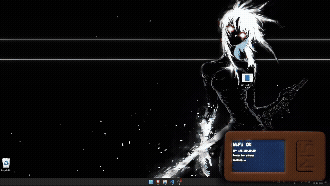
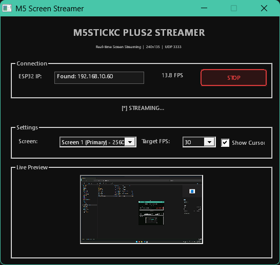
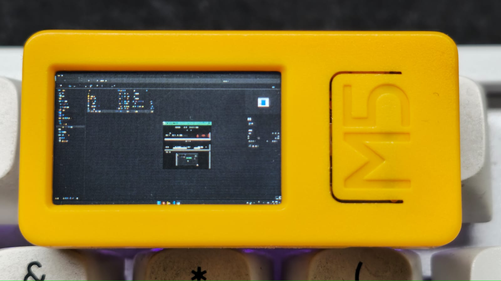
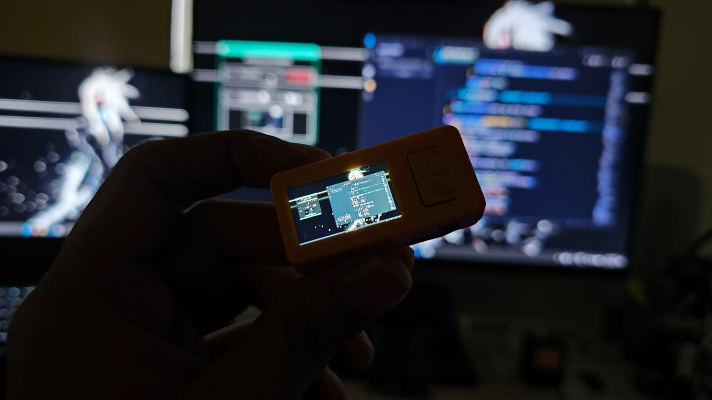

# 📺 ESP32 Wireless Screen Streamer

Stream your Windows desktop to an M5StickC Plus2 in real-time over WiFi!

 

> Turn your tiny M5StickC Plus2 into a wireless mini-monitor for your PC

---

## ✨ Features

- 🖥️ **Multi-monitor support** — Choose which screen to stream
- 🎯 **Auto-discovery** — Automatically finds your ESP32 on the network
- 🖱️ **Cursor capture** — Toggle mouse cursor visibility
- ⚡ **Adjustable FPS** — 15 / 30 / 60 FPS options
- 📺 **Live preview** — See what's being streamed in the Windows app
- 🔄 **Aspect ratio preservation** — Proper letterboxing, no stretching
- 🚀 **Zero dependencies** — Native Win32 app, no Python/Node needed

---

## 📸 Screenshots

| Windows App | M5StickC Plus2 |
|-------------|----------------|
|  |  |

---

## 🛠️ Hardware Required

| Component | Notes |
|-----------|-------|
| **M5StickC Plus2** | ESP32-based with 240x135 TFT display |
| **Windows PC** | Windows 10/11 |
| **WiFi Network** | Both devices on same network |



---

## 📦 Installation

### Step 1: Flash the ESP32

#### Prerequisites
- [Arduino IDE](https://www.arduino.cc/en/software) or [PlatformIO](https://platformio.org/)
- [M5StickC Plus2 Board Package](https://docs.m5stack.com/en/arduino/m5stickc_plus2/arduino_ide)

#### Setup Arduino IDE

1. **Add M5Stack Board URL** to Arduino IDE:
   - Go to `File` → `Preferences`
   - Add to "Additional Board Manager URLs":
     ```
     https://static-cdn.m5stack.com/resource/arduino/package_m5stack_index.json
     ```

2. **Install Board Package**:
   - Go to `Tools` → `Board` → `Boards Manager`
   - Search for "M5Stack" and install **M5Stack by M5Stack**

3. **Install Required Library**:
   - Go to `Sketch` → `Include Library` → `Manage Libraries`
   - Search and install: **M5StickCPlus2**

4. **Configure Your WiFi**:
   - Open `M5Screen/M5Screen.ino`
   - Edit these lines with your WiFi credentials:
     ```cpp
     const char* WIFI_SSID = "YOUR_WIFI_SSID";
     const char* WIFI_PASS = "YOUR_WIFI_PASSWORD";
     ```

5. **Upload**:
   - Select Board: `Tools` → `Board` → `M5Stack` → `M5StickCPlus2`
   - Select Port: `Tools` → `Port` → (your COM port)
   - Click **Upload**

---

### Step 2: Build the Windows App

#### Option A: Use Pre-built Release
Download from [Releases](https://github.com/aayushchouhan24/ESP32-Screen-Mirroring/releases)

#### Option B: Build from Source

**Prerequisites:**
- Visual Studio 2019/2022 with C++ Desktop Development workload
- OR MinGW-w64 / MSYS2

**Using Visual Studio Developer Command Prompt:**
```cmd
cl /O2 /EHsc screen_streamer.cpp /link ws2_32.lib gdi32.lib comctl32.lib shcore.lib user32.lib
```

**Using g++ (MinGW):**
```bash
g++ -O2 screen_streamer.cpp -o screen_streamer.exe -lws2_32 -lgdi32 -lcomctl32 -lshcore -mwindows
```

---

## 🚀 Usage

1. **Power on your M5StickC Plus2**
   - It will connect to WiFi and display its IP address
   - Status will show "Ready for stream"

2. **Run `screen_streamer.exe`**
   - The app will automatically scan for your ESP32
   - Once found, streaming starts automatically!

3. **Controls:**
   - **Screen dropdown** — Select which monitor to stream
   - **FPS dropdown** — Adjust frame rate (15/30/60)
   - **Show Cursor** — Toggle mouse cursor visibility
   - **STOP/START** — Control streaming

---

## 🔧 How It Works

```
┌─────────────┐     UDP/WiFi      ┌─────────────────┐
│  Windows PC │ ───────────────►  │  M5StickC Plus2 │
│             │   RGB565 chunks   │                 │
│  Capture    │   (1400 bytes)    │  Reassemble &   │
│  Downscale  │                   │  Display        │
│  Convert    │                   │                 │
└─────────────┘                   └─────────────────┘
```

### Data Flow:
1. **Capture** — GDI captures screen at native resolution
2. **Downscale** — Resize to 240x135 with aspect ratio preservation
3. **Convert** — RGB888 → RGB565 (16-bit color, 2 bytes/pixel)
4. **Chunk** — Split 64,800 byte frame into ~47 UDP packets
5. **Transfer** — Send over WiFi with header `[0xAA 0x55] [chunk_id]`
6. **Reassemble** — ESP32 collects all chunks into framebuffer
7. **Display** — Push complete frame to TFT via `pushImage()`

### Protocol:
```
Discovery Ping:  [0xAA] [0x55]  (2 bytes)
Frame Chunk:     [0xAA] [0x55] [chunk_index] [data...]  (3 + 1400 bytes)
```

---

## 📊 Performance

| Setting | Typical FPS | Notes |
|---------|-------------|-------|
| 60 FPS target | ~25-35 actual | Limited by WiFi/UDP |
| 30 FPS target | ~25-30 actual | Good balance |
| 15 FPS target | ~15 actual | Low latency |

**Bottlenecks:**
- ESP32 WiFi stack throughput
- UDP packet loss on congested networks
- Screen capture overhead on low-end PCs

---

## 🐛 Troubleshooting

### ESP32 not found
- Ensure both devices are on the **same WiFi network**
- Check if your router allows UDP broadcast
- Try manually entering the IP shown on M5Stick

### Low FPS / Choppy
- Reduce target FPS to 15 or 30
- Move closer to WiFi router
- Reduce network congestion

### Display shows garbage
- Power cycle the M5StickC Plus2
- Restart the Windows app

### Won't compile (Arduino)
- Ensure you have the latest M5StickCPlus2 library
- Select the correct board in Tools menu

---

## 📁 Project Structure

```
esp32-screen-streamer/
├── M5Screen/
│   └── M5Screen.ino      # ESP32 firmware
├── screen_streamer.cpp    # Windows streaming app
├── images/                # Screenshots and demos
│   ├── demo.gif
│   ├── windows-app.png
│   ├── m5stick-display.jpg
│   └── hardware.jpg
└── README.md
```

---

## 🤝 Contributing

Contributions welcome! Ideas for improvement:
- [ ] Linux/Mac streamer app
- [ ] Touch input support (control PC from M5Stick)
- [ ] Frame compression (JPEG/RLE)
- [ ] Multiple ESP32 support
- [ ] Audio streaming

---

## 📄 License

MIT License — feel free to use, modify, and distribute!

---

## 🙏 Acknowledgments

- [M5Stack](https://m5stack.com/) for the awesome hardware
- [ESP32 Arduino Core](https://github.com/espressif/arduino-esp32)

---

**⭐ Star this repo if you found it useful!**
